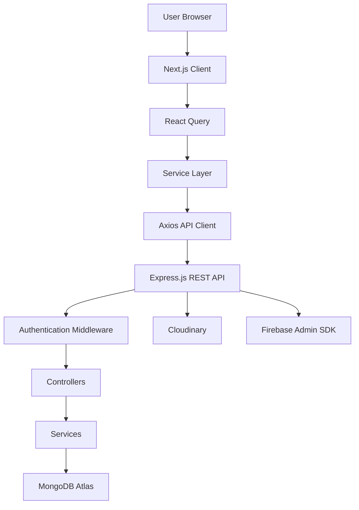
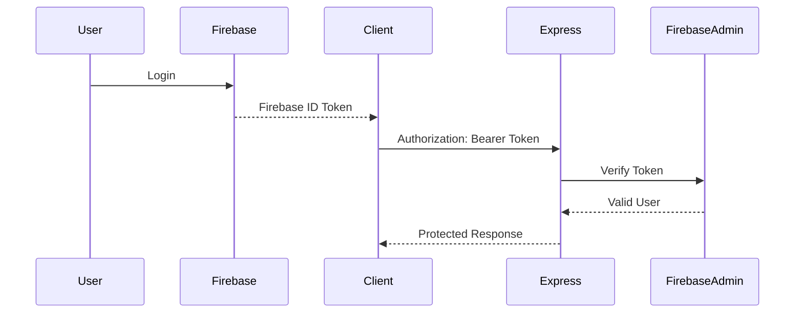
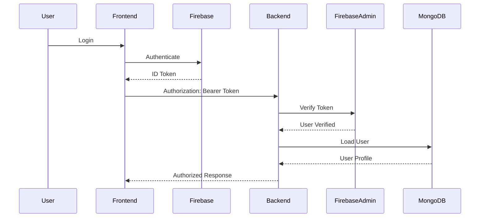
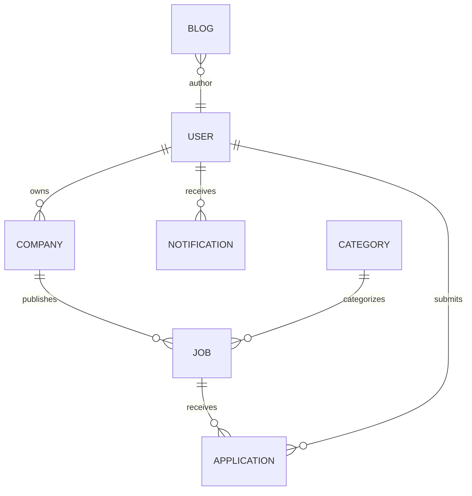

# CareerBridge

<div align="center">

# 🌉 CareerBridge

### Enterprise-Level AI-Ready Job Portal Platform

A modern full-stack recruitment platform connecting Job Seekers, Employers, Recruiters, and Administrators through a secure, scalable, and production-ready architecture.

---


</div>

---

# 🚀 Project Overview

CareerBridge is a modern enterprise-grade recruitment platform built using the MERN ecosystem and Next.js.

The platform connects employers with talented candidates through a secure, scalable, and user-friendly web application.

CareerBridge has been designed following modern software engineering principles including:

- Clean Architecture
- Feature-based structure
- Reusable components
- Type-safe APIs
- Enterprise authentication
- Role-based authorization
- React Query data management
- Production-ready deployment

The project follows a monorepo architecture and separates frontend and backend applications while maintaining a shared development workflow.

---

# 🎯 Project Objectives

CareerBridge aims to provide a complete recruitment ecosystem where:

- Job Seekers can discover and apply for jobs.
- Employers can publish and manage job postings.
- Administrators can moderate platform content.
- Super Administrators can manage the overall platform.

The application emphasizes:

- Security
- Performance
- Scalability
- Maintainability
- Accessibility
- Excellent user experience

---

# 👥 Target Users

## Public Visitors

- Browse jobs
- Explore companies
- Read blogs
- Search careers
- Contact platform

---

## Job Seekers

- Create profile
- Upload resumes
- Apply for jobs
- Track applications
- Receive notifications
- Save favorite jobs

---

## Employers

- Company management
- Publish jobs
- Review applicants
- Schedule interviews
- Manage recruitment workflow

---

## Administrators

- Moderate employers
- Approve jobs
- Manage users
- Manage categories
- Manage blogs
- Monitor reports

---

## Super Administrators

- Platform management
- Workspace management
- Analytics
- System configuration
- Administrator management

---

# ✨ Key Features

## 🌐 Public Website

- Responsive landing page
- Featured jobs
- Latest jobs
- Browse jobs
- Search jobs
- Companies
- Categories
- Blog
- About
- Contact
- FAQ
- Privacy Policy
- Terms & Conditions

---

## 🔐 Authentication

- Firebase Authentication
- Email & Password Login
- Google Sign-In
- Protected Routes
- Role-Based Authorization
- Account Status Verification

---

## 👨‍💼 Employer Module

- Employer Dashboard
- Company Profile
- Post Jobs
- Manage Jobs
- View Applications
- Candidate Shortlisting
- Interview Scheduling
- Analytics
- Notifications
- Settings

---

## 👩‍💻 Job Seeker Module

- Dashboard
- Profile Management
- Resume Management
- Job Search
- Job Applications
- Saved Jobs
- Job Alerts
- Notifications
- Settings

---

## 🛡️ Admin Module

- Dashboard
- User Management
- Employer Management
- Job Management
- Company Management
- Category Management
- Blog Management
- Reports

---

## 👑 Super Admin Module

- Dashboard
- Workspace Management
- Administrator Management
- System Settings
- Platform Analytics
- Global Configuration

---

# 🏗 Overall Architecture

CareerBridge follows a modern monorepo architecture.

```text
CareerBridge
│
├── client (Next.js)
│
├── server (Express.js)
│
└── Shared Development Workflow

---

# 🏛 Project Architecture

CareerBridge follows a layered, feature-oriented architecture that emphasizes separation of concerns, maintainability, scalability, and reusability.

## High-Level System Architecture



---

# Frontend Architecture

The frontend follows a clean layered architecture.

```mermaid
flowchart TD

Page

↓

Custom Hook

↓

Service

↓

Axios Client

↓

REST API
```

Each layer has a single responsibility.

| Layer | Responsibility |
|---------|----------------|
| Pages | UI rendering |
| Components | Reusable UI |
| Hooks | Business logic |
| Services | API communication |
| Axios | HTTP client |
| React Query | Data caching |
| Types | Shared interfaces |
| Schemas | Validation |

---

# Backend Architecture

The backend follows a modular Express architecture.

```mermaid
flowchart TD

Request

↓

Express Router

↓

Middleware

↓

Controller

↓

Service

↓

Database

↓

Response
```

---

# Authentication Flow

CareerBridge currently uses Firebase Authentication with Bearer Token verification.



---

# Data Flow

```mermaid
flowchart LR

UI

-->

React Query

-->

Service

-->

Axios

-->

Express API

-->

MongoDB Atlas
```

---

# Folder Structure

```text
careerbridge/

├── AGENTS.md
├── README.md
├── package.json
├── pnpm-lock.yaml
├── pnpm-workspace.yaml
│
├── client/
│   ├── app/
│   ├── components/
│   ├── hooks/
│   ├── lib/
│   ├── providers/
│   ├── services/
│   ├── types/
│   ├── schemas/
│   ├── public/
│   ├── styles/
│   ├── package.json
│   └── next.config.ts
│
├── server/
│   ├── src/
│   │   ├── config/
│   │   ├── controllers/
│   │   ├── middlewares/
│   │   ├── models/
│   │   ├── routes/
│   │   ├── services/
│   │   ├── utils/
│   │   ├── validations/
│   │   ├── tests/
│   │   └── server.ts
│   │
│   ├── package.json
│   └── tsconfig.json
│
└── docs/
```

> **Note:** Include a `shared/` directory only if it actually exists in your repository. Based on our discussions, the current structure is centered around `client/` and `server/`.

---

# Folder Explanation

## Root

Contains workspace configuration and project documentation.

---

## client/

Contains the Next.js frontend application.

Responsibilities:

- User Interface
- Routing
- Authentication
- React Query
- Forms
- API Communication

---

## server/

Contains the Express backend.

Responsibilities:

- REST API
- Authentication
- Authorization
- Business Logic
- Database Access

---

## app/

Next.js App Router pages and layouts.

---

## components/

Reusable UI components.

Examples:

- Buttons
- Cards
- Tables
- Forms
- Sidebar
- Navbar
- Charts
- Modals

---

## hooks/

Custom React hooks.

Examples:

- useAuth()
- useJobs()
- useEmployerDashboard()
- useNotifications()

---

## services/

API service layer.

Responsibilities:

- REST API calls
- Response mapping
- Error handling

---

## schemas/

Zod validation schemas.

---

## types/

Shared TypeScript types.

---

## models/

Mongoose models.

Examples:

- User
- Job
- Company
- Application
- Blog
- Category

---

## controllers/

HTTP request handlers.

---

## services/

Business logic.

Controllers remain thin while services encapsulate application rules.

---

## routes/

Express routers.

---

## middlewares/

Reusable middleware.

Examples:

- Authentication
- Authorization
- Error handling
- Validation
- Rate limiting

---

# ⚙️ Installation Guide

## Prerequisites

Install the following software before running CareerBridge.

| Software | Version |
|-----------|----------|
| Node.js | 22.x |
| pnpm | 11.5.2 |
| Git | Latest |
| MongoDB Atlas | Account Required |
| Firebase | Project Required |
| Cloudinary | Account Required |

---

## Clone Repository

```bash
git clone <YOUR_GITHUB_REPOSITORY>

cd careerbridge
```

---

## Install Dependencies

```bash
pnpm install
```

---

## Frontend Setup

```bash
cd client

pnpm install
```

---

## Backend Setup

```bash
cd ../server

pnpm install
```

---

# Running Development Servers

## Start Backend

```bash
cd server

pnpm run dev
```

---

## Start Frontend

```bash
cd client

pnpm run dev
```

Frontend:

```
http://localhost:3000
```

Backend:

```
http://localhost:5000
```

---

# Production Build

## Backend

```bash
cd server

pnpm run build

pnpm start
```

---

## Frontend

```bash
cd client

pnpm run build

pnpm start
```

---

# 🌎 Environment Variables

## Frontend (.env.local)

```env
NEXT_PUBLIC_API_URL=<YOUR_RENDER_API_URL>

NEXT_PUBLIC_FIREBASE_API_KEY=<YOUR_FIREBASE_API_KEY>

NEXT_PUBLIC_FIREBASE_AUTH_DOMAIN=<YOUR_FIREBASE_AUTH_DOMAIN>

NEXT_PUBLIC_FIREBASE_PROJECT_ID=<YOUR_FIREBASE_PROJECT_ID>

NEXT_PUBLIC_FIREBASE_STORAGE_BUCKET=<YOUR_FIREBASE_STORAGE_BUCKET>

NEXT_PUBLIC_FIREBASE_MESSAGING_SENDER_ID=<YOUR_FIREBASE_SENDER_ID>

NEXT_PUBLIC_FIREBASE_APP_ID=<YOUR_FIREBASE_APP_ID>
```

---

## Backend (.env)

```env
PORT=5000

NODE_ENV=development

CLIENT_URL=http://localhost:3000

MONGODB_URI=<YOUR_MONGODB_URI>

FIREBASE_PROJECT_ID=<YOUR_FIREBASE_PROJECT_ID>

FIREBASE_CLIENT_EMAIL=<YOUR_FIREBASE_CLIENT_EMAIL>

FIREBASE_PRIVATE_KEY=<YOUR_FIREBASE_PRIVATE_KEY>

CLOUDINARY_CLOUD_NAME=<YOUR_CLOUDINARY_CLOUD_NAME>

CLOUDINARY_API_KEY=<YOUR_CLOUDINARY_API_KEY>

CLOUDINARY_API_SECRET=<YOUR_CLOUDINARY_API_SECRET>
```

---

# 🔧 Project Scripts

## Root Workspace

| Command | Description |
|----------|-------------|
| `pnpm install` | Install all workspace dependencies |
| `pnpm lint` | Run linting |
| `pnpm typecheck` | Run TypeScript checks |
| `pnpm build` | Build the project |
| `pnpm verify` | Full project verification |

---

## Frontend

| Command | Description |
|----------|-------------|
| `pnpm run dev` | Development server |
| `pnpm run build` | Production build |
| `pnpm start` | Production server |
| `pnpm run lint` | ESLint |
| `pnpm run typecheck` | TypeScript validation |

---

## Backend

| Command | Description |
|----------|-------------|
| `pnpm run dev` | Development server |
| `pnpm run build` | Compile TypeScript |
| `pnpm start` | Run compiled server |
| `pnpm run lint` | ESLint |
| `pnpm run typecheck` | TypeScript validation |
| `pnpm test` | Run server tests |


---

# 🔐 Authentication & Authorization

CareerBridge uses **Firebase Authentication** for identity management and **Firebase Admin SDK** on the backend to verify user identity securely.

The application follows a stateless authentication model using **Firebase ID Tokens** transmitted in the `Authorization` header.

---

## Authentication Providers

Supported authentication methods:

- ✅ Email & Password
- ✅ Google Sign-In
- 🔄 Additional OAuth providers (future)

---

## Authentication Flow



---

## Authorization

CareerBridge implements **Role-Based Access Control (RBAC)**.

Authorization is enforced on:

- Frontend Route Guards
- Backend Middleware
- API Endpoints
- Database Ownership Validation

The backend is always considered the source of truth.

Frontend authorization improves UX only.

---

# 👥 User Roles

CareerBridge currently supports four user roles.

| Role | Description |
|--------|------------|
| Super Admin | Full platform administration |
| Admin | Platform moderation and management |
| Employer | Company and recruitment management |
| Job Seeker | Candidate profile and applications |

---

## 👑 Super Admin

Highest privilege.

Responsibilities include:

- Manage Admins
- Manage Employers
- Manage Job Seekers
- Manage Jobs
- Manage Categories
- Manage Companies
- Manage Blogs
- Manage Reports
- System Settings
- Platform Analytics

---

## 🛡 Admin

Platform moderator.

Can:

- Approve Employers
- Moderate Jobs
- Manage Categories
- Manage Blogs
- Review Reports

Cannot:

- Create Super Admins
- Modify Super Admin accounts
- Change Super Admin roles

---

## 🏢 Employer

Responsibilities:

- Company Profile
- Company Branding
- Publish Jobs
- Manage Jobs
- Review Applicants
- Update Application Status
- Schedule Interviews
- View Analytics

---

## 👨‍💻 Job Seeker

Responsibilities:

- Maintain Profile
- Upload Resume
- Search Jobs
- Apply for Jobs
- Save Jobs
- Track Applications
- Receive Notifications

---

# 🔑 Permission Matrix

| Feature | Super Admin | Admin | Employer | Job Seeker |
|-----------|:----------:|:-----:|:---------:|:----------:|
| Manage Users | ✅ | Limited | ❌ | ❌ |
| Manage Admins | ✅ | ❌ | ❌ | ❌ |
| Manage Employers | ✅ | ✅ | ❌ | ❌ |
| Manage Companies | ✅ | ✅ | Own | ❌ |
| Publish Jobs | ❌ | ❌ | ✅ | ❌ |
| Manage Own Jobs | ❌ | ❌ | ✅ | ❌ |
| Apply Jobs | ❌ | ❌ | ❌ | ✅ |
| Resume Upload | ❌ | ❌ | ❌ | ✅ |
| Manage Categories | ✅ | ✅ | ❌ | ❌ |
| Manage Blogs | ✅ | ✅ | ❌ | ❌ |
| System Settings | ✅ | ❌ | ❌ | ❌ |

---

# 🗄 Database Design

CareerBridge uses **MongoDB Atlas**.

Primary collections include:

```text
users

companies

jobs

applications

categories

blogs

notifications
```

---

## Users Collection

Stores:

- Authentication data
- Profile
- Role
- Status
- Avatar
- Preferences

Relationship

```text
User

↓

Employer

↓

Company
```

or

```text
User

↓

Job Seeker

↓

Applications
```

---

## Companies Collection

Stores:

- Company Name
- Logo
- Banner
- Biography
- Contact
- Industry
- Owner

Relationships

```text
Employer

↓

Company

↓

Jobs
```

---

## Jobs Collection

Stores:

- Title
- Description
- Salary
- Location
- Skills
- Company
- Employer
- Status
- Featured
- Deadline

Relationship

```text
Company

↓

Jobs

↓

Applications
```

---

## Applications Collection

Stores:

- Applicant
- Job
- Employer
- Resume
- Cover Letter
- Status
- Timeline

Relationship

```text
Job Seeker

↓

Application

↓

Job

↓

Employer
```

---

## Categories Collection

Stores:

- Category Name
- Slug
- Description

---

## Blogs Collection

Stores:

- Title
- Slug
- Content
- Cover Image
- Author
- Publish Status

---

## Notifications Collection

Stores:

- Recipient
- Type
- Title
- Message
- Read Status

---

# 📈 Database Relationships



---

# 🚀 API Overview

The backend exposes versioned REST APIs.

```text
/api/v1
```

---

## Authentication APIs

```text
POST /users/sync

GET /users/me
```

---

## User APIs

```text
GET /users

GET /users/:id

PATCH /users/:id

DELETE /users/:id
```

---

## Company APIs

```text
GET /companies

GET /companies/:id

POST /companies

PATCH /companies/:id
```

---

## Job APIs

```text
GET /jobs

GET /jobs/:slug

POST /jobs

PATCH /jobs/:id

DELETE /jobs/:id
```

---

## Application APIs

```text
GET /applications

POST /applications

PATCH /applications/:id

DELETE /applications/:id
```

---

## Category APIs

```text
GET /categories

POST /categories

PATCH /categories/:id
```

---

## Blog APIs

```text
GET /blogs

GET /blogs/:slug

POST /blogs

PATCH /blogs/:id
```

---

## Notification APIs

```text
GET /notifications

PATCH /notifications/:id
```

---

## Dashboard APIs

Protected dashboard APIs provide:

- Statistics
- Recent Activities
- Analytics
- Charts
- User Metrics

---

# 🔄 Application Workflow

## Employer Recruitment Workflow

```mermaid
flowchart TD

Employer

-->

Create Company

-->

Post Job

-->

Job Published

-->

Applications Received

-->

Review Applicants

-->

Update Status

-->

Interview

-->

Offer

-->

Hired
```

---

## Job Seeker Workflow

```mermaid
flowchart TD

Register

-->

Complete Profile

-->

Upload Resume

-->

Browse Jobs

-->

Apply

-->

Track Application

-->

Interview

-->

Offer

-->

Employment
```

---

## Admin Workflow

```mermaid
flowchart TD

Login

-->

Dashboard

-->

Review Employers

-->

Approve Jobs

-->

Manage Categories

-->

Monitor Reports
```

---

## Super Admin Workflow

```mermaid
flowchart TD

Login

-->

Platform Dashboard

-->

Manage Admins

-->

System Settings

-->

Platform Analytics

-->

Workspace Management
```

---

# 🎨 Theme Support

CareerBridge supports a complete application-wide theme system.

## Available Themes

- ☀️ Light Mode
- 🌙 Dark Mode
- 💻 System Mode

---

## Theme Features

- Persistent theme preference
- Instant theme switching
- System preference detection
- No layout shift
- No hydration mismatch
- Consistent across all dashboards
- Accessible color contrast

---

## Theme Coverage

The selected theme applies to:

- Public Website
- Authentication Pages
- Employer Dashboard
- Job Seeker Dashboard
- Admin Dashboard
- Super Admin Dashboard
- Navbar
- Sidebar
- Cards
- Forms
- Tables
- Charts
- Modals
- Dialogs
- Notifications

---

## Theme Architecture

```mermaid
flowchart LR

Theme Provider

-->

Layouts

-->

Pages

-->

Components

-->

Tailwind CSS

-->

UI
```


---

# 👨‍💻 Development Guidelines

CareerBridge follows a consistent, maintainable, and scalable development approach to ensure code quality across the entire project.

---

## AGENTS.md

The project includes an **AGENTS.md** file at the repository root.

All AI-assisted development (e.g., Codex CLI, ChatGPT, Claude Code) should follow the conventions defined in **AGENTS.md** before making changes.

Primary goals include:

- Preserve existing architecture
- Reuse existing components
- Reuse hooks and services
- Minimize unnecessary file changes
- Maintain TypeScript strict mode
- Keep the UI consistent
- Follow feature-based organization

---

## Coding Standards

### General

- Use TypeScript for all new code.
- Prefer functional React components.
- Keep functions small and focused.
- Avoid duplicate logic.
- Use meaningful variable and function names.
- Remove unused imports and dead code.
- Keep files focused on a single responsibility.

---

### Frontend Conventions

Preferred data flow:

```text
Page
 ↓
Custom Hook
 ↓
Service
 ↓
Axios Client
 ↓
REST API
```

Guidelines:

- Use React Query for server state.
- Keep UI components reusable.
- Prefer composition over duplication.
- Validate forms with React Hook Form + Zod.
- Keep business logic outside components.

---

### Backend Conventions

Preferred request flow:

```text
Route
 ↓
Middleware
 ↓
Controller
 ↓
Service
 ↓
Database
```

Controllers should remain thin.

Business logic belongs inside the Service layer.

---

### React Query Conventions

Recommended practices:

- Centralize query keys.
- Use descriptive query keys.
- Invalidate affected queries after mutations.
- Avoid unnecessary refetches.
- Handle loading and error states consistently.

---

### Tailwind CSS v4

Guidelines:

- Prefer utility-first styling.
- Reuse shared UI components.
- Avoid inline styles.
- Keep responsive behavior consistent.
- Follow the project's design system.

---

### TypeScript

Recommended practices:

- Enable strict mode.
- Avoid `any`.
- Prefer interfaces and reusable types.
- Keep shared types centralized.
- Use inferred types where appropriate.

---

# 🤝 Contributing

Contributions are welcome!

Please follow the workflow below.

---

## Development Workflow

1. Fork the repository.
2. Create a feature branch.
3. Implement your changes.
4. Run quality checks.
5. Submit a Pull Request.

---

## Branch Naming

Recommended conventions:

```text
feature/add-job-alerts

feature/company-profile

fix/sidebar-theme

fix/login-redirect

docs/update-readme

refactor/job-service
```

---

## Commit Message Convention

Examples:

```text
feat: add employer analytics dashboard

fix: resolve sidebar theme persistence

docs: update installation guide

refactor: optimize job service

test: add authentication middleware tests

chore: update dependencies
```

---

## Pull Request Checklist

Before submitting a Pull Request, verify:

- Code builds successfully.
- TypeScript has no errors.
- ESLint passes.
- New functionality is tested.
- Existing functionality is not broken.
- Documentation is updated where necessary.

---

# 🗺️ Roadmap

The roadmap reflects the current direction of the CareerBridge project.

---

## ✅ Completed

- Monorepo setup
- Next.js App Router
- Express.js API
- MongoDB Atlas integration
- Firebase Authentication
- Role-Based Access Control
- Employer dashboard
- Job Seeker dashboard
- Admin dashboard
- Super Admin dashboard
- Company management
- Job management
- Category management
- Blog management
- Notification system
- React Query integration
- Cloudinary integration
- Light/Dark/System theme support
- Production deployment foundation

---

## 🚧 In Progress

- Production optimization
- Performance improvements
- Comprehensive automated testing
- Documentation refinement
- Accessibility enhancements
- UI/UX polishing

---

## 🔮 Planned Features

Potential future enhancements:

- Advanced search filters
- Saved search preferences
- Email notifications
- Interview calendar integration
- Resume parsing
- AI-powered job recommendations
- AI-assisted resume analysis
- Employer subscription plans
- Multi-language support
- Advanced analytics
- Audit logging
- Public REST API documentation
- Mobile application
- Progressive Web App (PWA)

---

# ⚠️ Known Limitations

The following items should be reviewed before production release.

> Replace or remove items that are no longer applicable.

- Additional automated test coverage is recommended.
- Performance benchmarking should be completed before large-scale deployment.
- API documentation can be expanded with OpenAPI/Swagger.
- Production monitoring and alerting should be configured.
- CI/CD workflows can be extended with automated deployment validation.

---

# 📜 License

This project is licensed under the **MIT License**.

If you choose a different license, replace this section accordingly.

Example:

```text
MIT License

Copyright (c) <YEAR>

Permission is hereby granted...
```

Or simply include a dedicated `LICENSE` file at the repository root.

---

# 📬 Contact

Replace the placeholders below with your information.

| Platform | Link |
|----------|------|
| GitHub | https://github.com/<YOUR_USERNAME> |
| LinkedIn | https://linkedin.com/in/<YOUR_PROFILE> |
| Portfolio | https://<YOUR_PORTFOLIO> |
| Email | <YOUR_EMAIL> |

---

# 🙏 Acknowledgements

CareerBridge is built using the following open-source technologies and services.

## Frontend

- Next.js
- React
- TypeScript
- Tailwind CSS v4
- TanStack React Query
- React Hook Form
- Zod
- Axios

---

## Backend

- Node.js
- Express.js
- Mongoose

---

## Authentication

- Firebase Authentication
- Firebase Admin SDK

---

## Database

- MongoDB Atlas

---

## Cloud Services

- Cloudinary
- Vercel
- Render

---

## Development Tools

- pnpm Workspace
- ESLint
- Git
- GitHub
- VS Code
- Codex CLI

---

# 🌟 Support

If you find this project useful:

- ⭐ Star the repository
- 🍴 Fork the project
- 🐛 Report issues
- 💡 Suggest improvements
- 🤝 Contribute to the project

Your support helps improve CareerBridge for everyone.

---

# 📈 Project Status

| Status | Value |
|---------|-------|
| Development | 🚧 Active |
| Frontend | ✅ Implemented |
| Backend | ✅ Implemented |
| Authentication | ✅ Firebase |
| Database | ✅ MongoDB Atlas |
| Deployment | 🚧 In Progress |
| Documentation | ✅ Enterprise README |
| License | MIT (Placeholder) |

---

<div align="center">

## 🌉 CareerBridge

### Building Better Careers. Connecting Better Opportunities.

Made with ❤️ using Next.js, React, Express.js, MongoDB Atlas, Firebase, and TypeScript.

**Happy Coding! 🚀**

</div>